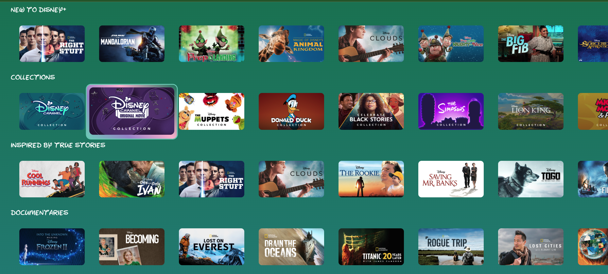
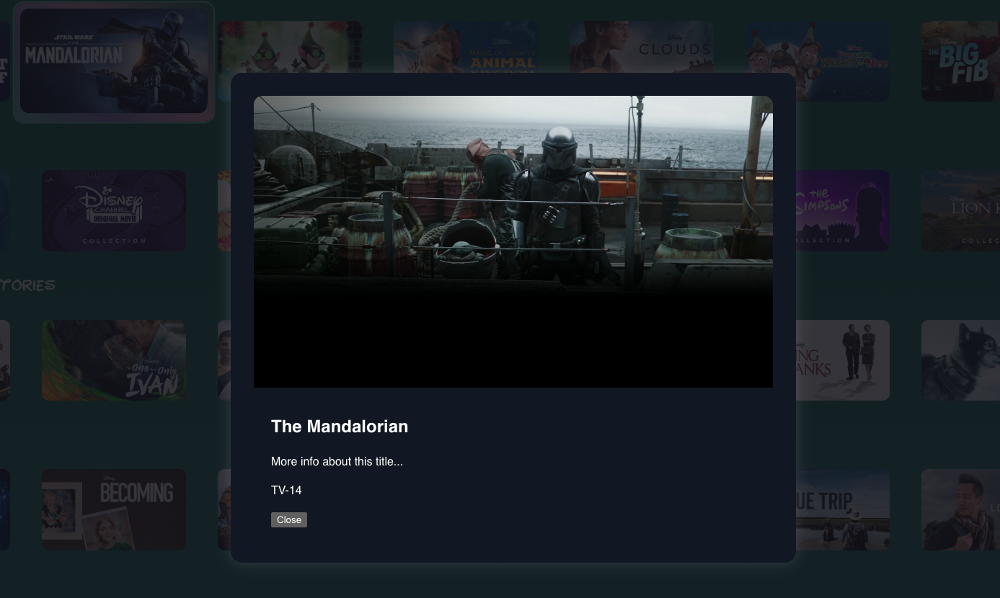

# 📺 Disney+ Streaming UI Clone (Take-Home Project)

This is a Roku-style streaming platform UI built as part of a take-home project. The app mimics a Disney+ home screen, including keyboard navigation, lazy loading of rows, and modal playback functionality.

---

## 🧱 Tech Stack

- **React** (functional components, hooks)
- **SCSS Modules** for component styling
- **Context API** for global state (shelves, content, UI)
- **IntersectionObserver** for lazy loading
- **Vite** as the dev/build tool

---

## 🚀 Getting Started

### Requirements

- Node.js v18 or v20 (LTS recommended)
  > ⚠️ Node 21+ is not supported due to incompatibilities with Vite and PostCss
- npm v9 or higher (or `pnpm`/`yarn` if preferred)

### Installation

```bash
git clone https://github.com/kcurbelo-accesso/video-stream.git
cd video-stream
npm install
npm run dev
```

Visit `http://localhost:5173` in your browser.

### Build for production

```bash
npm run build
```

The output is located in the `dist/` folder.

---

## 🎮 Keyboard Navigation

| Key              | Action                          |
| ---------------- | ------------------------------- |
| ⬅️/➡️ Left/Right | Navigate between tiles in a row |
| ⬆️/⬇️ Up/Down    | Move between rows               |
| ↵ Enter          | Open modal with video and info  |
| Esc              | Close modal                     |

> The app is designed with **remote-control UX** in mind and does not require a mouse.

---

## 🖼 Media

| Home Screen                                                                   |
| ----------------------------------------------------------------------------- |
|  |

| Modal Example                                                                       |
| ----------------------------------------------------------------------------------- |
|  |

---

## ✨ Features

- [x] Fully keyboard-navigable UI
- [x] Lazy loads rows when scrolled into view
- [x] Modal with embedded video and metadata
- [x] Context-driven state management
- [x] Scalable component-based architecture

---

## ✍️ Project Requirements

### Requirements

- [✅] Create a screen that consumes the home page API and renders the pre-populated data onto the screen.
- [✅] Use the 1.78 aspect ratio images for displa
- [✅] Fully keyboard-navigable UI
- [✅] Minimum layout should display multiple rows of data

### Extra Stuff

- [✅] Allow interaction or selection of a tile. For example, show a modal with data on selection.
- [✅] Lazy loads the “ref sets” as they come into view
- [✅] Incorporate transitions and/or visual aesthetics
- [✅] Add some Disney magic

---

## 🛠 Improvements (If I Had More Time)

- [ ] Add unit tests with React Testing Library + Jest
- [ ] Add type-safe API layer (Axios + Zod or tRPC)
- [ ] Improve accessibility (ARIA roles, label, ...etc)
- [ ] Responsive layout for smaller screens
- [ ] Use an animation lib for modal and tile animations
- [ ] Refined CSS to smooth navigation transitions, align shelf labels horizontally, and apply responsive spacing when scaling focused tiles.
- [ ] Rework hack solution for lazy loading in `lazy-row.tsx`

---

## 🎨 Design Tradeoffs

- I chose **React Context** over Redux/RTK for size, simplicity and locality of state.
- Lazy loading logic is implemented with **IntersectionObserver**, though it could be further optimized using a react library for virtualization, like `react-window`, for large data sets.
- The modal reuses the same content structure and pulls in video URL by `contentId`, but does not preload the full set of asset variants.
- Styles use **SCSS Modules** instead of Tailwind, or other popular tools, for finer layout control and theme flexibility.

---

## 📁 Project Structure

```
src/
├── components/
│   ├── composite/
│   │   ├── LazyRow/
│   │   │   ├── index.tsx
│   │   │   └── lazy-row.tsx
│   │   └── TileModal/
│   │       ├── index.tsx
│   │       └── tile-modal.tsx
│   ├── pages/
│   │   └── Home/
│   │       └── index.tsx
│   ├── ui/
│   │   ├── Collection/
│   │   │   └── index.tsx
│   │   ├── Loader/
│   │   │   └── index.tsx
│   │   ├── Modal/
│   │   │   └── Modal.tsx
│   │   ├── Row/
│   │   │   └── Row.tsx
│   │   ├── Tile/
│   │   │   ├── index.tsx
│   │   │   └── Tile.tsx
│   │   └── index.tsx
├── context/
│   └── MovieCollectionContext.tsx
├── selectors/
│   ├── contentSelector.ts
│   └── api.ts
├── services/
│   └── api/
│       ├── api.service.ts
│       └── index.ts
├── types/
│   ├── api/
│   │   ├── homeJson.ts
│   │   └── refIdJson.ts
│   ├── data/
│   │   ├── collection.ts
│   │   ├── global.ts
│   │   └── enums/
│   │       └── index.ts
├── utils/
│   ├── array.utils.ts
│   └── api.utils.ts
├── App.scss
├── App.tsx
├── main.tsx
├── index.css
└── index.html

```

---

## 🧪 Notes for Reviewer

- The UI is navigable without a mouse.
- Shelves are normalized and stored using `refId` and `setId`.
- Lazy rows only fetch their data when scrolled/navigated into view.
- Modals support full-screen background video playback and dynamically load content.
- Without full context of set id and ref id, there is an adhoc solution for "Because You watched Gordan Ramsey shelf"
